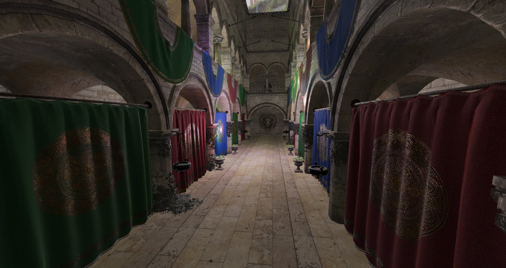
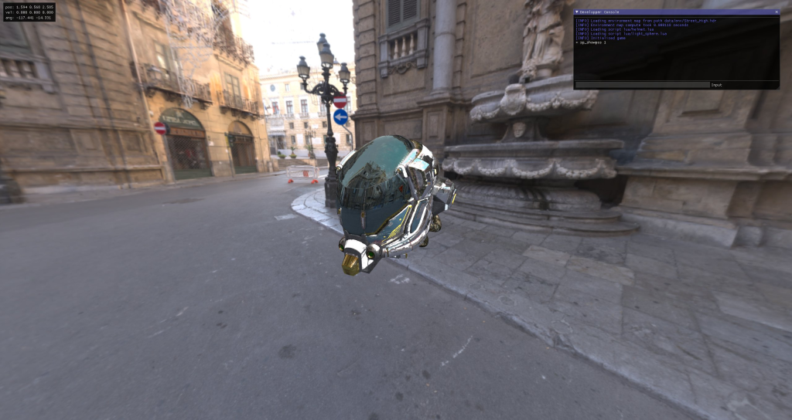
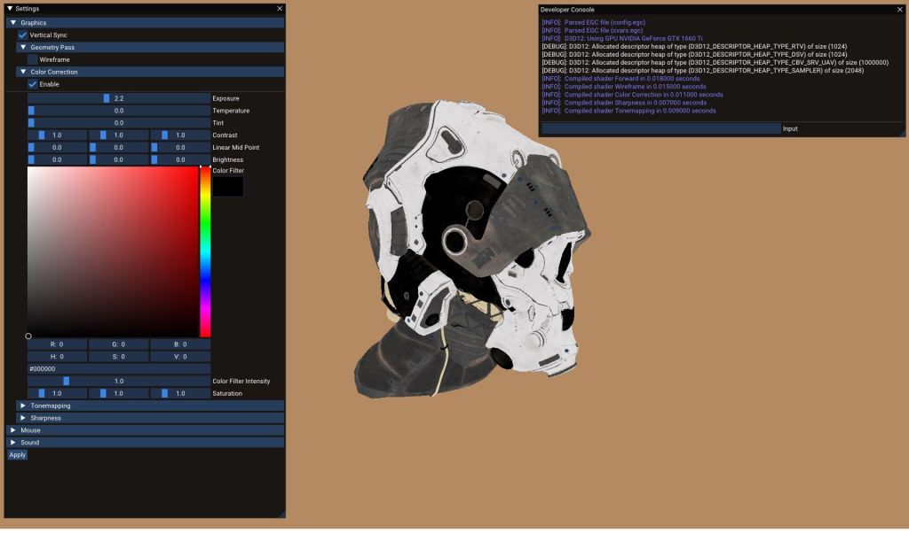
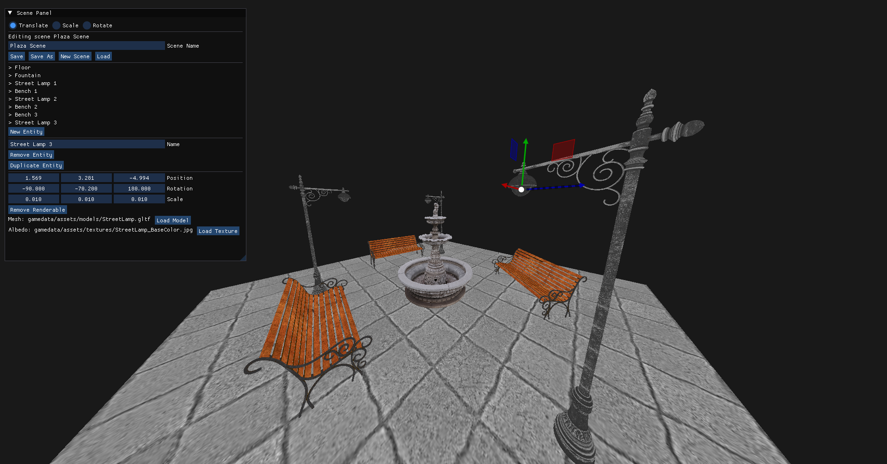
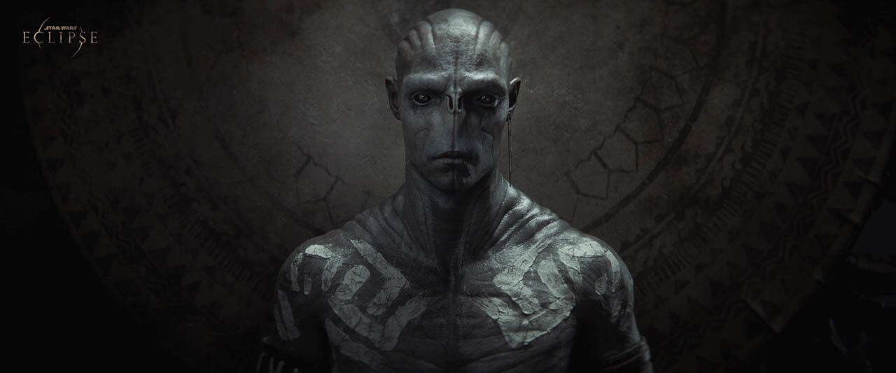

<h1 align="center">Hi, I'm Amélie (she/any).</h1>

# 👩🏻‍💻 About Me

💡  17 year old french programmer.\
🎓 I'm currently studying at the Epitech engineering university in Paris.\
✍️ In my free time, I enjoy playing games.\
👩🏻‍💻 I like core game engine programming, graphics programming, shader art, and making apps and games for consoles.\
💡 My favorite languages are C and C++, but I have experiences in other low level languages, like Odin and a bit of Rust.\
🛠 I have experience with technologies like DirectX 11 and 12, Vulkan, OpenGL, as well as console development such as the PS5 or Switch homebrew.

# 🛠 Some of my personal projects

[Aurora (C, Vulkan)](https://github.com/AmelieHeinrich/aurora)

[Voyage (C++, D3D11)](https://github.com/AmelieHeinrich/voyage)

[Game Project (C++, D3D12)](https://github.com/AmelieHeinrich/GameProject)

[Untitled Horror Game (C++, D3D11)](https://github.com/AmelieHeinrich/UntitledHorrorGame)

# 🛠 Games I've worked on

[Star Wars Eclipse (Quantic Dream)](https://www.starwarseclipse.com)

# Socials
- Twitter: AmelieHDev
- Discord: ritualpassion
- Email: amelie.heinrich.dev@gmail.com
