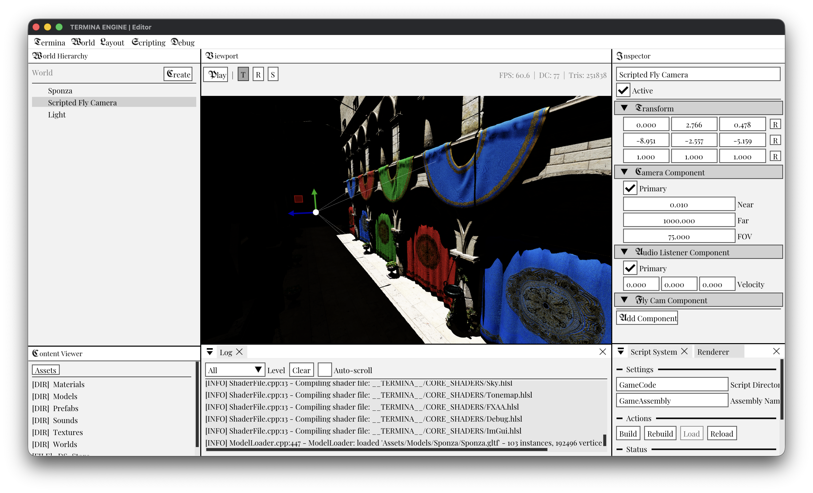
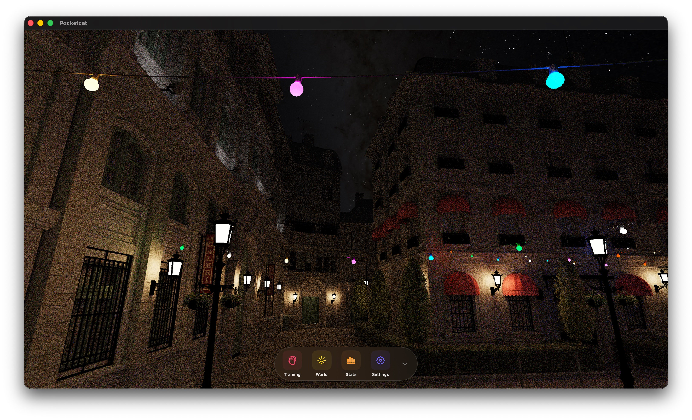
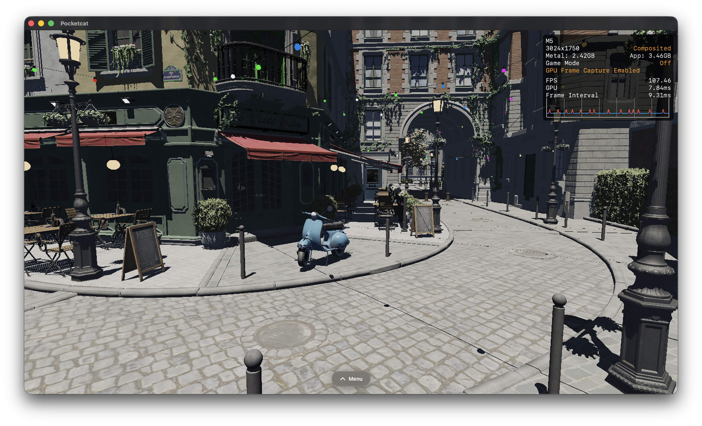
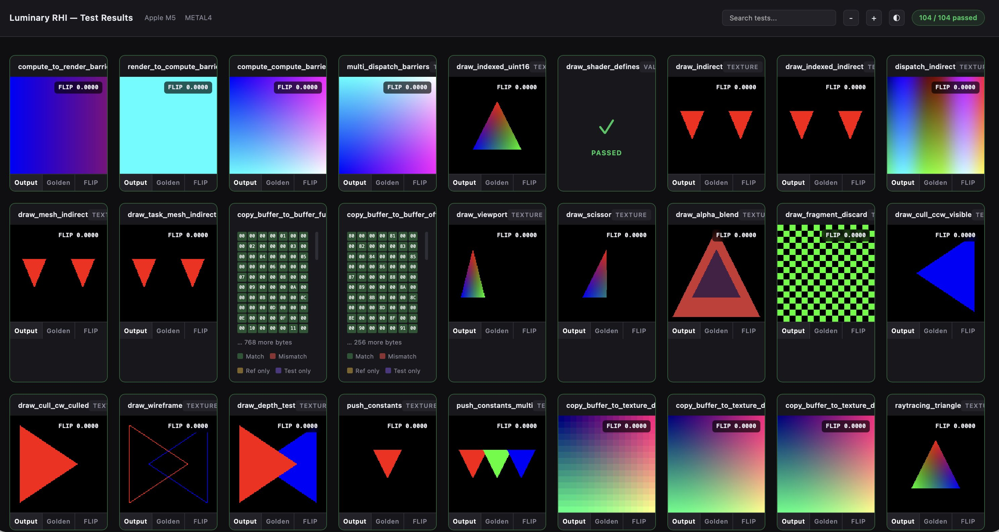

Hi, I'm Amélie, I do computer graphics, engine programming and machine learning.

I was previously an intern in graphics at Quantic Dream and Ubisoft Montpellier.
Je parle Français, also English, litt norsk, でも僕の日本語はめっちゃ悪いです

I specialize in modern graphics rendering, raytracing and GPU-driven pipelines. I also dig Apple platforms and console SDKs.
Business inquiries: amelie.heinrich.dev@gmail.com

My main rendering project is [Pocketcat](https://github.com/AmelieHeinrich/Pocketcat), a cutting edge Metal 4 renderer. I'm also working on a video game.

I'm also on Twitter : @Dispatch_Graph

Here's some of the stuff I do:

