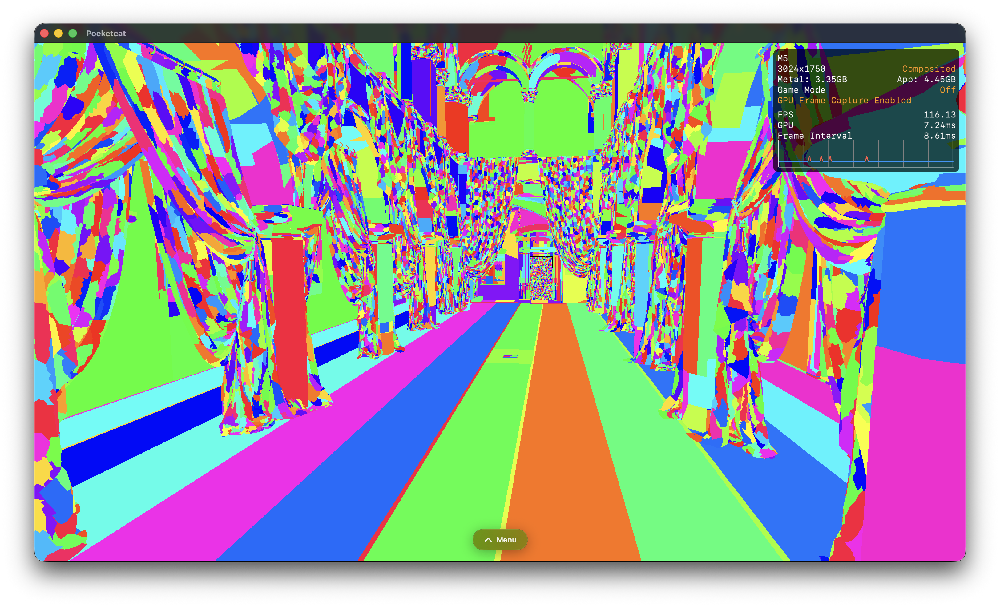
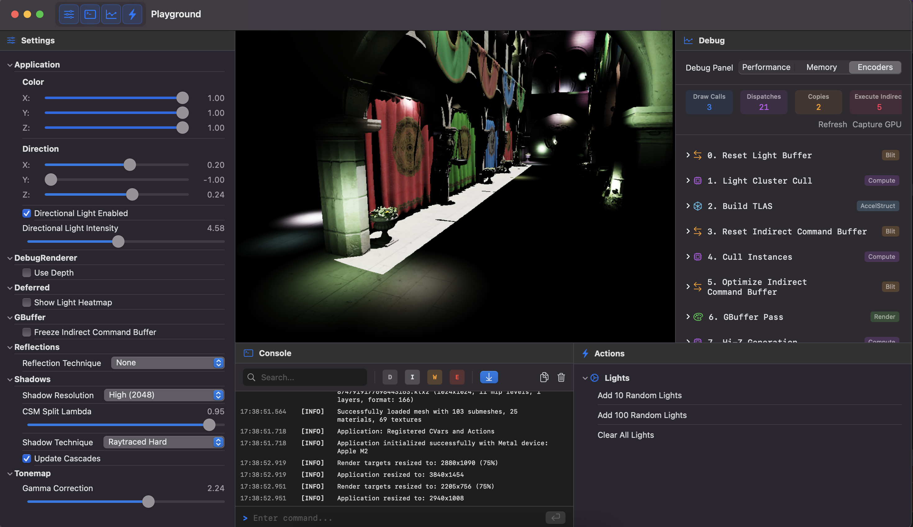
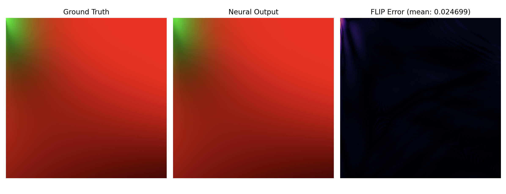
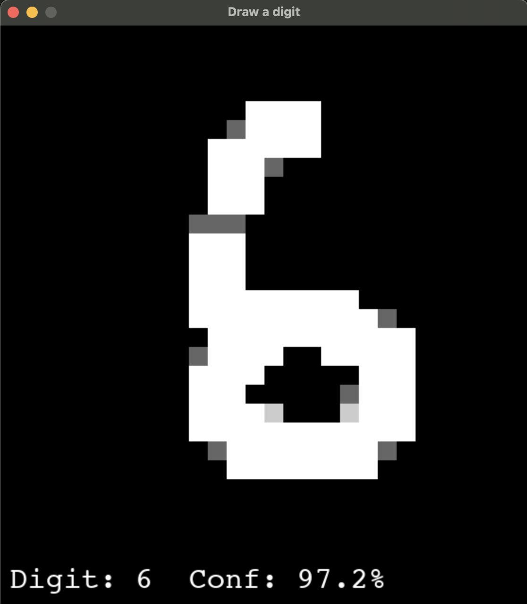

Hi, I'm Amélie, I do computer graphics, engine programming and machine learning magic.

I was previously an intern in graphics at Quantic Dream and Ubisoft Montpellier.
Je parle Français, also English, litt norsk, でも僕の日本語はめっちゃ悪いです

I specialize in modern graphics rendering, raytracing and GPU-driven pipelines. I also dig Apple platforms and console SDKs.
Business inquiries: amelie.heinrich.dev@gmail.com

Currently working on a cross-platform modern engine and game for my indie studio.
I'm also on Twitter : @Dispatch_Graph

Here's what you've been missing:

